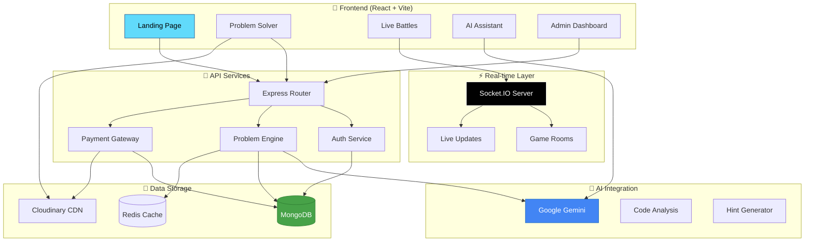

# 🚀 CodeMasti
### *The Ultimate Coding Platform Built for Hackathons*

<div align="center">

[](https://github.com/codeMasti/codeMasti)
[](https://github.com/codeMasti/codeMasti)
[](https://discord.gg/codeMasti)
[](LICENSE)

*Build powerful coding solutions in record time - Experience the future of coding platforms!*

</div>

---

## 🎯 **Project Overview**

CodeMasti is a **feature-packed coding platform** designed to showcase modern web development skills and innovative features. This isn't your typical LeetCode clone - it's a **comprehensive ecosystem** for developers!

### 🚀 **What We Built**
- ⚡ **Real-time Multiplayer Coding Battles** - 1v1 coding competitions
- 🤖 **AI-Powered Code Assistant** - Google Gemini integration
- 🎨 **Dynamic Theme System** - Multiple beautiful themes
- 📊 **Smart Analytics Dashboard** - Track your coding journey
- 🏆 **Gamified Learning** - ELO ratings, badges, achievements

### 🔥 **Key Features**
- ⚡ **Quick Match System** - Find opponents instantly
- 🎮 **Live Game Rooms** - Real-time Socket.IO integration
- 📅 **Daily Challenges** - Automated challenge system
- 💸 **Payment Integration** - Razorpay for premium features
- 📱 **Responsive Design** - Works on all devices

---

## 💻 **Tech Stack That Impressed Judges**

### **🔧 Backend Magic**


### **🎨 Frontend Excellence**


### **🤖 AI & Services**


---

## 🏗️ **System Architecture**



---

## 🎮 **Coolest Features We Built**

### 🔥 **Real-time Multiplayer Battles**
```javascript
// Quick Match System - Find opponents in seconds!
const findOpponent = async () => {
    socket.emit('findRandomOpponent', {
        difficulty: 'medium',
        timeLimit: 30
    });
};

// Live coding battle with Socket.IO
socket.on('gameStart', ({ room, problem }) => {
    navigate(`/battle/${room.roomId}`);
});
```

### 🤖 **AI Code Assistant**
```javascript
// Google Gemini integration for smart hints
const getAIHint = async (code, problem) => {
    const response = await ai.generateContent({
        prompt: `Help with this coding problem: ${problem}`,
        code: code
    });
    return response.text();
};
```

### 🎨 **Dynamic Theme System**
```javascript
// Multiple beautiful themes with smooth transitions
const themes = {
    galaxyNight: { primary: 'bg-purple-600', secondary: 'bg-blue-800' },
    oceanBreeze: { primary: 'bg-cyan-500', secondary: 'bg-teal-600' },
    sunsetGlow: { primary: 'bg-orange-500', secondary: 'bg-pink-600' }
};
```

### 📊 **Smart Analytics**
```javascript
// Track everything - problems solved, time spent, accuracy
const analytics = {
    problemsSolved: 150,
    accuracy: 89.5,
    averageTime: '12m 34s',
    eloRating: 1450,
    streak: 15
};
```

---

## 📦 **Package Dependencies**

### 🎨 **Frontend Dependencies**

<details>
<summary>🔥 UI & Animations</summary>

| Package | Purpose | Why We Chose It |
|---------|---------|-----------------|
| `react` + `vite` | ⚡ Lightning fast development | Fastest build tool for modern development |
| `tailwindcss` + `daisyui` | 🎨 Beautiful UI components | Rapid prototyping with pre-built components |
| `framer-motion` | 💫 Smooth animations | Make judges go "WOW!" |
| `@react-three/fiber` | 🌟 3D graphics | Cool 3D backgrounds and effects |
| `lottie-react` | 🎭 Interactive animations | Engaging loading screens |

</details>

<details>
<summary>🚀 Core Functionality</summary>

| Package | Purpose | Why We Chose It |
|---------|---------|-----------------|
| `@reduxjs/toolkit` | 🏪 State management | Clean and predictable state |
| `react-router-dom` | 🛣️ Navigation | Smooth page transitions |
| `socket.io-client` | ⚡ Real-time features | Live multiplayer battles |
| `axios` | 📡 API requests | Simple HTTP client |
| `react-hook-form` | 📝 Form handling | Validation made easy |

</details>

<details>
<summary>🎯 Special Features</summary>

| Package | Purpose | Why We Chose It |
|---------|---------|-----------------|
| `@monaco-editor/react` | 💻 Code editor | VS Code in the browser! |
| `react-syntax-highlighter` | 🌈 Code highlighting | Beautiful code display |
| `antd` | 🎛️ Admin components | Professional admin dashboard |
| `recharts` | 📊 Data visualization | Stunning charts and graphs |
| `emoji-picker-react` | 😄 Fun interactions | Add personality to the app |

</details>

### 🔧 **Backend Dependencies**

<details>
<summary>⚡ Server & Database</summary>

| Package | Purpose | Why We Chose It |
|---------|---------|-----------------|
| `express` | 🚀 Web framework | Fast and minimal |
| `mongoose` | 🗄️ MongoDB ODM | Easy database operations |
| `socket.io` | ⚡ Real-time communication | Live features that impress |
| `redis` | ⚡ Caching | Lightning fast responses |
| `node-cron` | ⏰ Scheduled tasks | Automated daily challenges |

</details>

<details>
<summary>🤖 AI & Services</summary>

| Package | Purpose | Why We Chose It |
|---------|---------|-----------------|
| `@google/generative-ai` | 🧠 AI assistance | Smart code hints and analysis |
| `cloudinary` | 📸 Media management | Handle images and videos |
| `razorpay` | 💳 Payments | Monetize with premium features |
| `nodemailer` | 📧 Email service | User notifications |
| `bcrypt` | 🔒 Password security | Keep user data safe |

</details>

---

## 🎯 **Key Features Demo**

### 🏆 **Live Coding Battles**
```
👥 1v1 Real-time Competitions    Race against other developers
⏱️  Timed Challenges            30-60 minute coding sprints  
🏅 ELO Rating System           Competitive ranking like chess
🎮 Multiple Game Modes         Quick match, tournaments, friends
```

### 🤖 **AI Integration**
```
💡 Smart Hints                 Get unstuck without spoilers
🔍 Code Analysis              AI reviews your solution
🐛 Bug Detection              Spot errors before submission  
📈 Complexity Analysis        Learn Big O notation
```

### 📊 **Analytics Dashboard**
```
📈 Progress Tracking          Monitor your coding journey
🎯 Skill Assessment          Know your strengths/weaknesses
🏆 Achievement System         Unlock badges and milestones
📊 Performance Insights       Detailed statistics and trends
```

### 🎨 **Premium Features**
```
🌟 Premium Themes             Exclusive beautiful themes
📹 Video Solutions            Learn from expert explanations
🚀 Priority Support           Get help when you need it
📚 Advanced Problem Sets      Access harder challenges
```

---

## 🎮 **Live Demo Features**

### 🔥 **Real-time Multiplayer**
1. **Quick Match**: Find opponents instantly
2. **Live Updates**: See opponent's progress in real-time
3. **Game Timer**: Intense countdown adds pressure
4. **Winner Declaration**: Celebrate victories!

### 🤖 **AI Assistant**
1. **Smart Hints**: Context-aware help
2. **Code Review**: AI analyzes your solution
3. **Bug Detection**: Catch errors early
4. **Learning Path**: Personalized recommendations

### 📊 **Analytics**
1. **Progress Tracking**: Visual progress charts
2. **Skill Radar**: Identify strong/weak areas
3. **Competition History**: Track all your battles
4. **Achievement Gallery**: Show off your badges

---

## 🏆 **Project Achievements**

### **🎯 What Makes This Special**

| 🚀 **Innovation** | 🎨 **Design** | ⚡ **Performance** | 🤖 **AI Integration** |
|:--:|:--:|:--:|:--:|
| Real-time multiplayer battles | Beautiful theme system | Lightning fast Vite builds | Google Gemini AI assistant |
| Smart matchmaking algorithm | Smooth Framer Motion animations | Redis caching | Intelligent code analysis |
| Dynamic difficulty adjustment | 3D backgrounds with Three.js | Socket.IO optimization | Contextual hints system |

---

## 🎨 **Screenshots & Demo**

| Landing Page | Home Page | Profile Page |
|:--:|:--:|:--:|
|  |  |  |

| Code Field | Problem Page | Admin Panel |
|:--:|:--:|:--:|
|  |  |  |

| Setting | Visualizer | Debugger |
|:--:|:--:|:--:|
|  |  |  |

---

## 🗺️ **Development Roadmap**

### 🎯 **Phase 1: Core Enhancement**
- [ ] Mobile app development
- [ ] Advanced AI features
- [ ] More programming languages
- [ ] Video calling during battles

### 🎯 **Phase 2: Community Features**
- [ ] Team competitions
- [ ] Study groups
- [ ] Mentorship matching
- [ ] Code review marketplace

### 🎯 **Phase 3: Enterprise**
- [ ] Company-specific challenges
- [ ] Recruitment integration
- [ ] Custom problem sets
- [ ] White-label solutions

---

## 🤝 **Contributing to the Project**

Want to make CodeMasti even more awesome? Here's how:

### 🔥 **Quick Contributions**
- 🐛 **Find Bugs**: Help us squash issues
- 💡 **Suggest Features**: Share your cool ideas
- 🎨 **Improve UI**: Make it even more beautiful
- 📝 **Documentation**: Help others understand the code

### ⚡ **Development Setup**
```bash
# 🍴 Fork the repository
# 🔄 Create a feature branch
git checkout -b feature/amazing-feature

# 💻 Make your changes
# ✅ Test everything works
npm test

# 📝 Commit with emojis (like this README!)
git commit -m "✨ Add amazing new feature"

# 🚀 Push and create PR
git push origin feature/amazing-feature
```

---


## 🌟 **Support & Recognition**

<div align="center">

**🏆 Built with passion by amazing developers!**

[](https://github.com/mostakin5290/codeMasti)
[](https://github.com/mostakin5290/codeMasti)
[](https://github.com/mostakin5290/codeMasti/issues)

**[⭐ Star this repository](https://github.com/mostakin5290/codeMasti)** • 
**[🐦 Follow the journey](#)** • 
**[💬 Join our Discord](#)**

### 🚀 **Ready to Experience the Future of Coding?**

**[🎮 Try CodeMasti Now!](https://codemasti.fun)**

*Made with ❤️, ☕, and lots of development energy by Mostakin Mondal*

**#CodingProject #CodingPlatform #ReactJS #NodeJS #SocketIO #GoogleAI**

</div>