<!-- # 🚀 CodeMasti
### *The Ultimate Coding Platform for Developers*

<div align="center">


[](https://github.com/codeMasti/codeMasti)
[](LICENSE)
[](https://github.com/codeMasti/codeMasti/releases)
[](https://discord.gg/codeMasti)

*Empowering developers worldwide to master coding skills, ace technical interviews, and build exceptional careers*

</div>

---

## 🌟 **What Makes CodeMasti Special?**

CodeMasti isn't just another coding platform – it's your complete companion for programming excellence. Whether you're a beginner taking your first steps or a seasoned developer preparing for FAANG interviews, CodeMasti provides everything you need to succeed.

<table>
<tr>
<td width="50%">

### 🎯 **For Learners**
- **Interactive Learning Paths** - Structured courses from basics to advanced
- **Real-time Code Execution** - Test your solutions instantly
- **Personalized Progress Tracking** - Monitor your growth journey
- **AI-Powered Hints** - Get intelligent guidance when stuck

</td>
<td width="50%">

### 🏆 **For Competitors**
- **Live Coding Contests** - Compete with developers globally
- **Leaderboards & Rankings** - Track your competitive standing
- **Contest Analytics** - Detailed performance insights
- **Achievement System** - Earn badges and recognition

</td>
</tr>
</table>

---

## ✨ **Core Features**

### 🎨 **Exceptional User Experience**
```
🖥️  Modern, Responsive Interface     Built with React,Tailwind CSS & Daisy UI
🎨  Dynamic Theme System             Multiple beautiful themes to choose from
💫  Smooth Animations                Powered by Framer Motion & WebGL
📱  Cross-Platform Compatibility     Works seamlessly on all devices
```

### 💻 **Comprehensive Problem Library**
```
📚  10,000+ Coding Problems         Curated from real interview questions
🔍  Advanced Search & Filtering     Find problems by topic, difficulty, company
📊  Detailed Problem Analytics      Track success rates and common mistakes
🎯  Company-Specific Collections    Problems from Google, Amazon, Microsoft & more
```

### 🤖 **AI-Powered Learning Assistant**
```
💡  Intelligent Hints              Get contextual help without spoilers
🔍  Code Review & Optimization     AI analyzes your code for improvements
📈  Complexity Analysis            Understand time and space complexity
🐛  Smart Debugging Suggestions    AI helps identify and fix errors
```

### 🏅 **Competitive Programming**
```
⚡  Live Contests                  Regular competitions with prizes
🏆  Global Leaderboards           Compete with developers worldwide
📊  Performance Analytics         Track your competitive growth
🎖️  Achievement System            Earn badges and showcase skills
```

---

## 🛠️ **Technology Stack**

<div align="center">

### **Backend Architecture**


### **Frontend Experience**


### **Cloud & Services**


</div>

### **🔧 Backend Services**
<details>
<summary><b>Click to expand backend details</b></summary>

| Category | Technologies | Purpose |
|----------|-------------|---------|
| **Runtime & Framework** | Node.js, Express.js | Fast, scalable server foundation |
| **Database** | MongoDB, Mongoose | Flexible NoSQL data storage |
| **Authentication** | JWT, bcrypt, Passport.js | Secure user management |
| **AI Integration** | Google Generative AI, Google APIs | Intelligent code assistance |
| **Media & Payments** | Cloudinary, Razorpay | Asset management & transactions |
| **Communication** | Nodemailer, Redis | Email services & caching |
| **Security** | Validator, CORS, Rate Limiting | Data validation & protection |

</details>

### **🎨 Frontend Application**
<details>
<summary><b>Click to expand frontend details</b></summary>

| Category | Technologies | Purpose |
|----------|-------------|---------|
| **Core Framework** | React, Vite | Modern UI development |
| **State Management** | Redux Toolkit, React Query | Predictable state handling |
| **Styling** | Tailwind CSS, DaisyUI | Beautiful, responsive design |
| **Animations** | Framer Motion, Lottie | Engaging user interactions |
| **Code Editor** | Monaco Editor, Prism.js | Advanced code editing |
| **Forms** | React Hook Form, Zod | Efficient form management |
| **UI Components** | Ant Design, Headless UI | Rich component library |

</details>

---

## 🏗️ **System Architecture**

```mermaid
graph TB
    subgraph "🌐 Frontend Layer"
        A[React Application]
        B[Redux Store]
        C[Component Library]
    end
    
    subgraph "🔗 API Gateway"
        D[Express Router]
        E[Middleware Stack]
        F[Rate Limiting]
    end
    
    subgraph "🧠 Core Services"
        G[Authentication Service]
        H[Problem Service]
        I[Contest Service]
        J[AI Assistant Service]
    end
    
    subgraph "💾 Data Layer"
        K[(MongoDB)]
        L[(Redis Cache)]
        M[(File Storage)]
    end
    
    subgraph "🌍 External Services"
        N[Google AI]
        O[Cloudinary]
        P[Razorpay]
        Q[Email Service]
    end
    
    A --> D
    B --> D
    C --> D
    D --> G
    D --> H
    D --> I
    D --> J
    G --> K
    H --> K
    I --> K
    J --> N
    H --> L
    I --> L
    G --> Q
    A --> O
    G --> P
    
    style A fill:#61DAFB,stroke:#21538E,color:#000
    style K fill:#47A248,stroke:#2E7D32,color:#fff
    style L fill:#DC382D,stroke:#B71C1C,color:#fff
    style N fill:#4285F4,stroke:#1565C0,color:#fff
```

<div align="center">



</div>

---

## 📊 **Key Features Deep Dive**

### 🎯 **Problem Solving Environment**
- **Multi-language Support**: C++, Java, Python, JavaScript, Go, Rust
- **Real-time Code Execution**: Instant feedback on your solutions
- **Test Case Management**: Comprehensive test suites for each problem
- **Memory & Time Limits**: Realistic constraints matching interview standards

### 🤖 **AI-Powered Assistance**
- **Code Analysis**: Get detailed feedback on your coding style
- **Optimization Suggestions**: Learn how to improve time/space complexity
- **Bug Detection**: AI identifies common programming errors
- **Learning Recommendations**: Personalized next steps based on your progress

### 🏆 **Competitive Programming**
- **Contest Formats**: Weekly contests, sprint challenges, themed competitions
- **Rating System**: ELO-based rating similar to competitive programming platforms
- **Virtual Contests**: Practice with past contest problems
- **Team Competitions**: Collaborate with friends in team contests

### 📈 **Progress Tracking**
- **Skill Assessment**: Comprehensive evaluation of your programming abilities
- **Learning Paths**: Structured courses for different skill levels
- **Achievement System**: Unlock badges and milestones
- **Analytics Dashboard**: Detailed insights into your coding journey

---

## 🎨 **Screenshots**

<div align="center">

| Dashboard | Problem Solving | Contest Arena |
|:---------:|:---------------:|:-------------:|
|  |  |  |

| AI Assistant | Progress Tracking | Community |
|:------------:|:-----------------:|:---------:|
|  |  |  |

</div>

---

## 🤝 **Contributing**

We welcome contributions from the community! Here's how you can help:

### **Ways to Contribute**
- 🐛 **Bug Reports**: Help us identify and fix issues
- 💡 **Feature Requests**: Suggest new features and improvements
- 📝 **Documentation**: Improve our guides and documentation
- 🔧 **Code Contributions**: Submit pull requests for bug fixes or features
- 🎨 **Design**: Help improve the user interface and experience


## 📜 **License**

This project is licensed under the MIT License - see the [LICENSE](LICENSE) file for details.

---

## 🌟 **Support the Project**

<div align="center">

**Love CodeMasti? Help us grow!**

[](https://github.com/codemasti9/codeMasti)

**[⭐ Star this repository](https://github.com/codeMasti/codeMasti)** • **[🐦 Follow us on Twitter](https://twitter.com/codeMasti)** • **[💬 Join our Discord](https://discord.gg/codeMasti)**

---

*Made with ❤️ by Mostakin Mondal

**Ready to Masti with code? [Get Started Now!](https://codemasti.versel.app)**

</div> -->


# 🚀 CodeMasti
### *The Ultimate Coding Platform Built for Hackathons*


![CodeMasti Banner](https://via.placeholder.com/800x200/4F46E5/FFFFFF?text=CodeMasti+-+Code+Your+Way+to+Success.shields.io/badge/build-hackathon--readyps://img.shields.shields.io/badge/version-hackathon--v1.0-orange.svgshields.io/badge/Discord-Join%20Community in record time for hackathons - Experience the future of coding platforms!*


## 🎯 **Hackathon Project Overview**

CodeMasti is a **feature-packed coding platform** built during hackathons to showcase modern web development skills and innovative features. This isn't your typical LeetCode clone - it's a **comprehensive ecosystem** for developers!


### 🚀 **What We Built**
- ⚡ **Real-time Multiplayer Coding Battles** - 1v1 coding competitions
- 🤖 **AI-Powered Code Assistant** - Google Gemini integration
- 🎨 **Dynamic Theme System** - Multiple beautiful themes
- 📊 **Smart Analytics Dashboard** - Track your coding journey
- 🏆 **Gamified Learning** - ELO ratings, badges, achievements


### 🔥 **Hackathon Features**
- ⚡ **Quick Match System** - Find opponents instantly
- 🎮 **Live Game Rooms** - Real-time Socket.IO integration
- 📅 **Daily Challenges** - Automated challenge system
- 💸 **Payment Integration** - Razorpay for premium features
- 📱 **Responsive Design** - Works on all devices


## 💻 **Tech Stack That Impressed Judges**


### **🔧 Backend Magic**
![Node.js](https://img.shields.io/badge/Node.js-339933?style=for-the-badge&logo](https://img.shields.io/badge/Express.js-000000?style=for-the-badge&logo=express&io/badge/MongoDB-47A248?style=for-the-badge&logo=mongodb&img.shields.io/badge/Socket.IO-010101?style=for-the-badge&logo=shields.io/badge/Redis-DC382D?style=for-the-badge&logo=redis&logoiance**
 => {
    socket.emit('findRandomOpponent', {
        difficulty: 'medium',
        timeLimit: 30
    });
};

// Live coding battle with Socket.IO
socket.on('gameStart', ({ room, problem }) => {
    navigate(`/battle/${room.roomId}`);
});
```

### 🤖 **AI Code Assistant**
```javascript
// Google Gemini integration for smart hints
const getAIHint = async (code, problem) => {
    const response = await ai.generateContent({
        prompt: `Help with this coding problem: ${problem}`,
        code: code
    });
    return response.text();
};
```

### 🎨 **Dynamic Theme System**
```javascript
// Multiple beautiful themes with smooth transitions
const themes = {
    galaxyNight: { primary: 'bg-purple-600', secondary: 'bg-blue-800' },
    oceanBreeze: { primary: 'bg-cyan-500', secondary: 'bg-teal-600' },
    sunsetGlow: { primary: 'bg-orange-500', secondary: 'bg-pink-600' }
};
```

### 📊 **Smart Analytics**
```javascript
// Track everything - problems solved, time spent, accuracy
const analytics = {
    problemsSolved: 150,
    accuracy: 89.5,
    averageTime: '12m 34s',
    eloRating: 1450,
    streak: 15
};
```

## 📦 **Package.json Breakdown**

### 🎨 **Frontend Dependencies**

🔥 UI & Animations (Click to expand)

| Package | Purpose | Why We Chose It |
|---------|---------|-----------------|
| `react` + `vite` | ⚡ Lightning fast development | Fastest build tool for hackathons |
| `tailwindcss` + `daisyui` | 🎨 Beautiful UI components | Rapid prototyping with pre-built components |
| `framer-motion` | 💫 Smooth animations | Make judges go "WOW!" |
| `@react-three/fiber` | 🌟 3D graphics | Cool 3D backgrounds and effects |
| `lottie-react` | 🎭 Interactive animations | Engaging loading screens |


🚀 Core Functionality (Click to expand)

| Package | Purpose | Why We Chose It |
|---------|---------|-----------------|
| `@reduxjs/toolkit` | 🏪 State management | Clean and predictable state |
| `react-router-dom` | 🛣️ Navigation | Smooth page transitions |
| `socket.io-client` | ⚡ Real-time features | Live multiplayer battles |
| `axios` | 📡 API requests | Simple HTTP client |
| `react-hook-form` | 📝 Form handling | Validation made easy |


🎯 Special Features (Click to expand)

| Package | Purpose | Why We Chose It |
|---------|---------|-----------------|
| `@monaco-editor/react` | 💻 Code editor | VS Code in the browser! |
| `react-syntax-highlighter` | 🌈 Code highlighting | Beautiful code display |
| `antd` | 🎛️ Admin components | Professional admin dashboard |
| `recharts` | 📊 Data visualization | Stunning charts and graphs |
| `emoji-picker-react` | 😄 Fun interactions | Add personality to the app |


### 🔧 **Backend Dependencies**

⚡ Server & Database (Click to expand)

| Package | Purpose | Why We Chose It |
|---------|---------|-----------------|
| `express` | 🚀 Web framework | Fast and minimal |
| `mongoose` | 🗄️ MongoDB ODM | Easy database operations |
| `socket.io` | ⚡ Real-time communication | Live features that impress |
| `redis` | ⚡ Caching | Lightning fast responses |
| `node-cron` | ⏰ Scheduled tasks | Automated daily challenges |


🤖 AI & Services (Click to expand)

| Package | Purpose | Why We Chose It |
|---------|---------|-----------------|
| `@google/generative-ai` | 🧠 AI assistance | Smart code hints and analysis |
| `cloudinary` | 📸 Media management | Handle images and videos |
| `razorpay` | 💳 Payments | Monetize with premium features |
| `nodemailer` | 📧 Email service | User notifications |
| `bcrypt` | 🔒 Password security | Keep user data safe |


## 🎯 **Key Features Demo**

### 🏆 **Live Coding Battles**
```
👥 1v1 Real-time Competitions    Race against other developers
⏱️  Timed Challenges            30-60 minute coding sprints  
🏅 ELO Rating System           Competitive ranking like chess
🎮 Multiple Game Modes         Quick match, tournaments, friends
```

### 🤖 **AI Integration**
```
💡 Smart Hints                 Get unstuck without spoilers
🔍 Code Analysis              AI reviews your solution
🐛 Bug Detection              Spot errors before submission  
📈 Complexity Analysis        Learn Big O notation
```

### 📊 **Analytics Dashboard**
```
📈 Progress Tracking          Monitor your coding journey
🎯 Skill Assessment          Know your strengths/weaknesses
🏆 Achievement System         Unlock badges and milestones
📊 Performance Insights       Detailed statistics and trends
```

### 🎨 **Premium Features**
```
🌟 Premium Themes             Exclusive beautiful themes
📹 Video Solutions            Learn from expert explanations
🚀 Priority Support           Get help when you need it
📚 Advanced Problem Sets      Access harder challenges
```

## 🚀 **Quick Start Guide**

### 📁 **Project Structure**
```
codemasti/
├── 🎨 frontend/               # React + Vite app
│   ├── src/
│   │   ├── components/        # Reusable UI components
│   │   ├── pages/            # Main application pages
│   │   ├── context/          # Theme and global state
│   │   └── api/              # API integration
│   └── package.json          # Frontend dependencies
├── 🔧 backend/               # Node.js + Express API
│   ├── src/
│   │   ├── controllers/      # Business logic
│   │   ├── models/           # Database schemas
│   │   ├── routes/           # API endpoints
│   │   └── utils/            # Helper functions
│   └── package.json          # Backend dependencies
└── 📚 README.md              # This awesome documentation!
```

### ⚡ **Installation & Setup**
```bash
# 🚀 Clone the hackathon project
git clone https://github.com/codeMasti/codeMasti.git
cd codeMasti

# 🎨 Setup Frontend
cd frontend
npm install
npm run dev        # Starts on http://localhost:5173

# 🔧 Setup Backend (in new terminal)
cd ../backend
npm install
npm run dev        # Starts on http://localhost:3000
```

### 🔑 **Environment Variables**
```bash
# Backend .env file
MONGODB_URI=mongodb://localhost:27017/codemasti
JWT_SECRET=your-super-secret-key
GOOGLE_AI_API_KEY=your-gemini-api-key
CLOUDINARY_URL=your-cloudinary-url
RAZORPAY_KEY_ID=your-razorpay-key
REDIS_URL=redis://localhost:6379
```

## 🎮 **Live Demo Features**

### 🔥 **Real-time Multiplayer**
1. **Quick Match**: Find opponents instantly
2. **Live Updates**: See opponent's progress in real-time
3. **Game Timer**: Intense countdown adds pressure
4. **Winner Declaration**: Celebrate victories!

### 🤖 **AI Assistant**
1. **Smart Hints**: Context-aware help
2. **Code Review**: AI analyzes your solution
3. **Bug Detection**: Catch errors early
4. **Learning Path**: Personalized recommendations

### 📊 **Analytics**
1. **Progress Tracking**: Visual progress charts
2. **Skill Radar**: Identify strong/weak areas
3. **Competition History**: Track all your battles
4. **Achievement Gallery**: Show off your badges

## 🏆 **Hackathon Achievements**


### **🎯 What Makes This Special**

| 🚀 **Innovation** | 🎨 **Design** | ⚡ **Performance** | 🤖 **AI Integration** |
|:--:|:--:|:--:|:--:|
| Real-time multiplayer battles | Beautiful theme system | Lightning fast Vite builds | Google Gemini AI assistant |
| Smart matchmaking algorithm | Smooth Framer Motion animations | Redis caching | Intelligent code analysis |
| Dynamic difficulty adjustment | 3D backgrounds with Three.js | Socket.IO optimization | Contextual hints system |


## 🎨 **Screenshots & Demo**


| 🏠 Landing Page | 💻 Code Editor | ⚡ Live Battle |
|:--:|:--:|:--:|
| ![Landing](https://via.placeholder.com/300x200/4F46E5/FFFFFF?text=Modernplaceholder.com/300x200/059669/FFFFFF?.placeholder.com/300x200/DC2626/FFFFFF?text

| 🤖 AI Assistant | 📊 Analytics | 🎨 Theme Gallery |
|:--:|:--:|:--:|
| ![AI](https://via.placeholder.com/300x200/7Ccom/300x200/EA580C/FFFFFF?.placeholder.com/300x200/0891B2/FFFFFF?text=Dynamic Roadmap**

### 🎯 **Phase 1: Core Enhancement**
- [ ] Mobile app development
- [ ] Advanced AI features
- [ ] More programming languages
- [ ] Video calling during battles

### 🎯 **Phase 2: Community Features**
- [ ] Team competitions
- [ ] Study groups
- [ ] Mentorship matching
- [ ] Code review marketplace

### 🎯 **Phase 3: Enterprise**
- [ ] Company-specific challenges
- [ ] Recruitment integration
- [ ] Custom problem sets
- [ ] White-label solutions

## 🤝 **Contributing to the Hackathon Project**

Want to make CodeMasti even more awesome? Here's how:

### 🔥 **Quick Contributions**
- 🐛 **Find Bugs**: Help us squash issues
- 💡 **Suggest Features**: Share your cool ideas
- 🎨 **Improve UI**: Make it even more beautiful
- 📝 **Documentation**: Help others understand the code

### ⚡ **Development Setup**
```bash
# 🍴 Fork the repository
# 🔄 Create a feature branch
git checkout -b feature/amazing-feature

# 💻 Make your changes
# ✅ Test everything works
npm test

# 📝 Commit with emojis (like this README!)
git commit -m "✨ Add amazing new feature"

# 🚀 Push and create PR
git push origin feature/amazing-feature
```

## 📜 **License & Credits**

This hackathon project is licensed under the MIT License - see the [LICENSE](LICENSE) file for details.

## 🌟 **Support & Recognition**


**🏆 Built with passion during hackathons by amazing developers!**

[** -  **[🦠Follow the journey](https://twitter.com/codeMasti)** -  **[💬 Join our Discord](https://discord.gg/codeMasti)**

### 🚀 **Ready to Experience the Future of Coding?**

**[🎮 Try CodeMasti Now!](https://codemasti.vercel.app)**

*Made with ❤️, ☕, and lots of hackathon energy by Mostakin Mondal*

**#HackathonProject #CodingPlatform #ReactJS #NodeJS #SocketIO #Google


[1] https://via.placeholder.com/800x200/4F46E5/FFFFFF?text=CodeMasti+-+Code+Your+Way+to+Success
[2] https://img.shields.io/badge/build-