# 🚀 CodeCrack
### *The Ultimate Coding Platform for Developers*

<div align="center">


[](https://github.com/codecrack/codecrack)
[](LICENSE)
[](https://github.com/codecrack/codecrack/releases)
[](https://discord.gg/codecrack)

*Empowering developers worldwide to master coding skills, ace technical interviews, and build exceptional careers*

</div>

---

## 🌟 **What Makes CodeCrack Special?**

CodeCrack isn't just another coding platform – it's your complete companion for programming excellence. Whether you're a beginner taking your first steps or a seasoned developer preparing for FAANG interviews, CodeCrack provides everything you need to succeed.

<table>
<tr>
<td width="50%">

### 🎯 **For Learners**
- **Interactive Learning Paths** - Structured courses from basics to advanced
- **Real-time Code Execution** - Test your solutions instantly
- **Personalized Progress Tracking** - Monitor your growth journey
- **AI-Powered Hints** - Get intelligent guidance when stuck

</td>
<td width="50%">

### 🏆 **For Competitors**
- **Live Coding Contests** - Compete with developers globally
- **Leaderboards & Rankings** - Track your competitive standing
- **Contest Analytics** - Detailed performance insights
- **Achievement System** - Earn badges and recognition

</td>
</tr>
</table>

---

## ✨ **Core Features**

### 🎨 **Exceptional User Experience**
```
🖥️  Modern, Responsive Interface     Built with React,Tailwind CSS & Daisy UI
🎨  Dynamic Theme System             Multiple beautiful themes to choose from
💫  Smooth Animations                Powered by Framer Motion & WebGL
📱  Cross-Platform Compatibility     Works seamlessly on all devices
```

### 💻 **Comprehensive Problem Library**
```
📚  10,000+ Coding Problems         Curated from real interview questions
🔍  Advanced Search & Filtering     Find problems by topic, difficulty, company
📊  Detailed Problem Analytics      Track success rates and common mistakes
🎯  Company-Specific Collections    Problems from Google, Amazon, Microsoft & more
```

### 🤖 **AI-Powered Learning Assistant**
```
💡  Intelligent Hints              Get contextual help without spoilers
🔍  Code Review & Optimization     AI analyzes your code for improvements
📈  Complexity Analysis            Understand time and space complexity
🐛  Smart Debugging Suggestions    AI helps identify and fix errors
```

### 🏅 **Competitive Programming**
```
⚡  Live Contests                  Regular competitions with prizes
🏆  Global Leaderboards           Compete with developers worldwide
📊  Performance Analytics         Track your competitive growth
🎖️  Achievement System            Earn badges and showcase skills
```

---

## 🛠️ **Technology Stack**

<div align="center">

### **Backend Architecture**


### **Frontend Experience**


### **Cloud & Services**


</div>

### **🔧 Backend Services**
<details>
<summary><b>Click to expand backend details</b></summary>

| Category | Technologies | Purpose |
|----------|-------------|---------|
| **Runtime & Framework** | Node.js, Express.js | Fast, scalable server foundation |
| **Database** | MongoDB, Mongoose | Flexible NoSQL data storage |
| **Authentication** | JWT, bcrypt, Passport.js | Secure user management |
| **AI Integration** | Google Generative AI, Google APIs | Intelligent code assistance |
| **Media & Payments** | Cloudinary, Razorpay | Asset management & transactions |
| **Communication** | Nodemailer, Redis | Email services & caching |
| **Security** | Validator, CORS, Rate Limiting | Data validation & protection |

</details>

### **🎨 Frontend Application**
<details>
<summary><b>Click to expand frontend details</b></summary>

| Category | Technologies | Purpose |
|----------|-------------|---------|
| **Core Framework** | React, Vite | Modern UI development |
| **State Management** | Redux Toolkit, React Query | Predictable state handling |
| **Styling** | Tailwind CSS, DaisyUI | Beautiful, responsive design |
| **Animations** | Framer Motion, Lottie | Engaging user interactions |
| **Code Editor** | Monaco Editor, Prism.js | Advanced code editing |
| **Forms** | React Hook Form, Zod | Efficient form management |
| **UI Components** | Ant Design, Headless UI | Rich component library |

</details>

---

## 🏗️ **System Architecture**

```mermaid
graph TB
    subgraph "🌐 Frontend Layer"
        A[React Application]
        B[Redux Store]
        C[Component Library]
    end
    
    subgraph "🔗 API Gateway"
        D[Express Router]
        E[Middleware Stack]
        F[Rate Limiting]
    end
    
    subgraph "🧠 Core Services"
        G[Authentication Service]
        H[Problem Service]
        I[Contest Service]
        J[AI Assistant Service]
    end
    
    subgraph "💾 Data Layer"
        K[(MongoDB)]
        L[(Redis Cache)]
        M[(File Storage)]
    end
    
    subgraph "🌍 External Services"
        N[Google AI]
        O[Cloudinary]
        P[Razorpay]
        Q[Email Service]
    end
    
    A --> D
    B --> D
    C --> D
    D --> G
    D --> H
    D --> I
    D --> J
    G --> K
    H --> K
    I --> K
    J --> N
    H --> L
    I --> L
    G --> Q
    A --> O
    G --> P
    
    style A fill:#61DAFB,stroke:#21538E,color:#000
    style K fill:#47A248,stroke:#2E7D32,color:#fff
    style L fill:#DC382D,stroke:#B71C1C,color:#fff
    style N fill:#4285F4,stroke:#1565C0,color:#fff
```

<div align="center">



</div>

---

## 📊 **Key Features Deep Dive**

### 🎯 **Problem Solving Environment**
- **Multi-language Support**: C++, Java, Python, JavaScript, Go, Rust
- **Real-time Code Execution**: Instant feedback on your solutions
- **Test Case Management**: Comprehensive test suites for each problem
- **Memory & Time Limits**: Realistic constraints matching interview standards

### 🤖 **AI-Powered Assistance**
- **Code Analysis**: Get detailed feedback on your coding style
- **Optimization Suggestions**: Learn how to improve time/space complexity
- **Bug Detection**: AI identifies common programming errors
- **Learning Recommendations**: Personalized next steps based on your progress

### 🏆 **Competitive Programming**
- **Contest Formats**: Weekly contests, sprint challenges, themed competitions
- **Rating System**: ELO-based rating similar to competitive programming platforms
- **Virtual Contests**: Practice with past contest problems
- **Team Competitions**: Collaborate with friends in team contests

### 📈 **Progress Tracking**
- **Skill Assessment**: Comprehensive evaluation of your programming abilities
- **Learning Paths**: Structured courses for different skill levels
- **Achievement System**: Unlock badges and milestones
- **Analytics Dashboard**: Detailed insights into your coding journey

---

## 🎨 **Screenshots**

<div align="center">

| Dashboard | Problem Solving | Contest Arena |
|:---------:|:---------------:|:-------------:|
|  |  |  |

| AI Assistant | Progress Tracking | Community |
|:------------:|:-----------------:|:---------:|
|  |  |  |

</div>

---

## 🤝 **Contributing**

We welcome contributions from the community! Here's how you can help:

### **Ways to Contribute**
- 🐛 **Bug Reports**: Help us identify and fix issues
- 💡 **Feature Requests**: Suggest new features and improvements
- 📝 **Documentation**: Improve our guides and documentation
- 🔧 **Code Contributions**: Submit pull requests for bug fixes or features
- 🎨 **Design**: Help improve the user interface and experience


## 📜 **License**

This project is licensed under the MIT License - see the [LICENSE](LICENSE) file for details.

---

## 🌟 **Support the Project**

<div align="center">

**Love CodeCrack? Help us grow!**

[](https://github.com/codecrack/codecrack)
[](https://twitter.com/codecrack)

**[⭐ Star this repository](https://github.com/codecrack/codecrack)** • **[🐦 Follow us on Twitter](https://twitter.com/codecrack)** • **[💬 Join our Discord](https://discord.gg/codecrack)**

---

*Made with ❤️ by the CodeCrack Team*

**Ready to crack the code? [Get Started Now!](https://codecrack.dev)**

</div>
